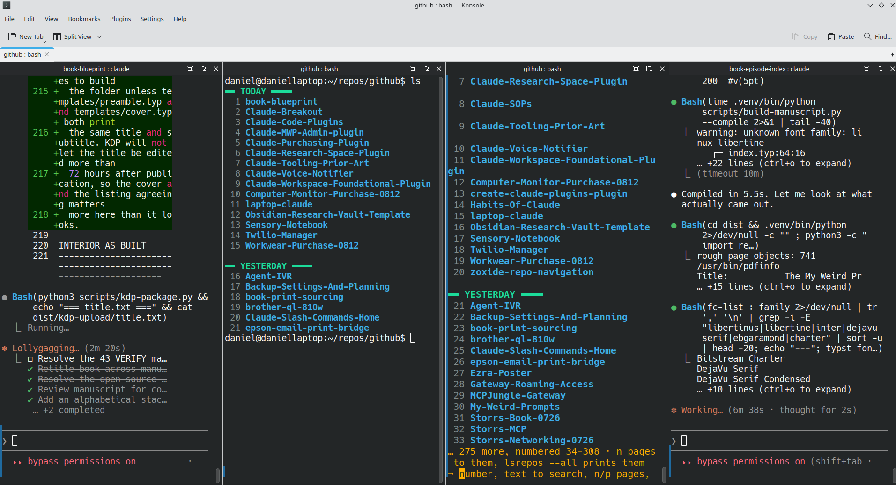

# Claude-Monitor-Research

**The question:** how much display does a multi-pane Claude Code workflow actually
need, measured in text cells rather than inches?

This is a workflow-driven display requirement, not a shopping list. It is
deliberately separate from the 2026-08-12 monitor purchase repos, which optimised
for a different variable:

| Repo | Optimised for |
|---|---|
| [`Computer-Monitor-Purchase-0812`](https://github.com/danielrosehill/Computer-Monitor-Purchase-0812) | Stand geometry — getting a panel to eye level without drilling |
| `Budget-Monitor-Purchase-0812` (private) | Price against that stand requirement |
| **This repo** | **Pixel budget — how many concurrent Claude panes stay legible** |

Those two settled on 23.8″ 1920×1080. That resolution is the same grid the laptop
already has, so it adds **zero pane capacity** — see [The 1080p trap](#the-1080p-trap)
below. That mismatch is why this repo exists.

---

## Baseline: what is being run today



`evidence/konsole-4-pane-1920x1080-2026-08-12.png` — captured 2026-08-12.

Four Konsole panes side by side, running concurrently:

| Pane | Session |
|---|---|
| 1 | `book-blueprint : claude` — mid-task, Typst/KDP packaging |
| 2 | `github : bash` — `lsrecent` repo listing |
| 3 | `github : bash` — `lsrepos` paged listing |
| 4 | `book-episode-index : claude` — manuscript build, 6m 38s in |

Two live Claude sessions plus two shells, in a single Konsole tab.

### Measured geometry

Hardware and settings, read off the machine rather than assumed:

| Property | Value | Source |
|---|---|---|
| Panel | `eDP-1`, 1920×1080, 344 × 193 mm | `xrandr` |
| Pixel density | **142 PPI** | 1920 ÷ 344 mm |
| Terminal font | **Hack 14** | `~/.local/share/konsole/My Theme.profile` |
| Cell size | ≈ **11.2 × 22.0 px** | line pitch measured off the screenshot (14 line gaps over 308 px) |
| Konsole window | 1913 × 1038 px | screenshot dimensions |
| Window chrome | ≈ 168 px vertical | title bar + menu + toolbar + tab bar |
| **Usable text grid** | **≈ 171 × 39 cells** | derived from the above |

### What four panes costs

171 columns ÷ 4 ≈ **42 columns per pane**, and about 40 after each pane's own
divider and scrollbar. Confirmed visually: pane 3 wraps
`Claude-Workspace-Foundational-Plugin` mid-word, and the `lsrepos` pager footer
spills across three lines.

**40 columns is half the 80-column norm.** Claude Code's own output — tool-call
headers, diff hunks, indented task lists — is laid out expecting considerably more.
Everything in panes 1 and 4 of the screenshot is wrapping.

---

## The open question: five stacked rows

The layout being considered is **five horizontal levels** — panes stacked as rows
rather than columns, so each one gets full window width.

On the current panel that is not viable, and the arithmetic is short enough to
settle it here:

```
39 usable text rows ÷ 5 panes  =  7.8 rows each
     less 1 row per pane title  ≈  6-7 visible lines of output
```

Six lines is less than a single Claude tool-call block. Horizontal stacking trades
the column problem for a worse row problem, because **vertical pixels are the
scarcer resource on 16:9**.

This is the thing the repo needs to resolve: whether the answer is more vertical
pixels, a taller aspect ratio, or fewer simultaneous panes.

---

## Candidate displays, in cells

Same font (Hack 14), same ≈ 11.2 × 22.0 px cell, same ≈ 168 px of chrome.
Grid figures are **derived arithmetic, not measured** — only the 1920×1080 row has
been observed directly.

| Display | Resolution | PPI | Text grid | 4 columns | 5 rows |
|---|---|---|---|---|---|
| **Laptop panel (current)** | 1920×1080 @ 14″ | 142 | 171 × 41 | 42 cols | 8 rows |
| 23.8″ 1080p | 1920×1080 | 93 | 171 × 41 | 42 cols | 8 rows |
| 24″ 16:10 | 1920×1200 | 94 | 171 × 46 | 42 cols | 9 rows |
| 27″ QHD | 2560×1440 | 109 | 228 × 57 | 57 cols | 11 rows |
| 34″ ultrawide | 3440×1440 | 110 | 307 × 57 | 76 cols | 11 rows |
| **32″ 4K @ 100%** | 3840×2160 | 138 | 342 × 90 | **85 cols** | **18 rows** |
| 27″ 4K @ 100% | 3840×2160 | 163 | 342 × 90 | 85 cols | 18 rows |
| 49″ super-ultrawide | 5120×1440 | 109 | 457 × 57 | 114 cols | 11 rows |

### The 1080p trap

A 23.8″ 1080p monitor is the *same 1920×1080 grid* as the laptop. It renders every
character 53% larger physically (93 PPI against 142) but shows **not one extra pane,
column or line**. For a workflow whose constraint is pane count, buying more inches
at the same resolution buys nothing.

This directly undercuts the outcome of `Computer-Monitor-Purchase-0812` *for this
use case* — that purchase was correct for its own brief (eye-level ergonomics on a
freestanding stand), and this is a different brief.

### Why 32″ 4K stands out

At 32″, 3840×2160 works out to **138 PPI — within 3% of the laptop's 142 PPI**.
Hack 14 therefore renders at essentially the same physical size it does now: no
scaling, no squinting, no relearning a font size. What changes is pure area —
**2.0× the columns and 2.2× the rows**.

That is the configuration where the five-row layout becomes real: 18 lines per pane
instead of 7, at full width.

Ultrawides win the column race but stay stuck at 1440 vertical pixels, which is the
axis the five-row question actually depends on.

---

## Status

**Seeded 2026-08-12.** Nothing bought, nothing decided. What exists so far is the
baseline evidence above and the arithmetic that frames the choice.

Open:

- [ ] Verify the derived cell grid on a borrowed or shop-floor QHD/4K panel rather than trusting the arithmetic
- [ ] Establish the real minimum readable width for a Claude Code pane — is it 80 columns, or does 60 work?
- [ ] Decide whether the answer is one large panel or the laptop plus a second screen
- [ ] Test whether five rows is genuinely the wanted layout, or whether a 2×3 grid reads better
- [ ] Re-check 32″ 4K pricing against the 23.8″ 1080p decision, US retail

## Layout

```
README.md    this document — question, measurements, arithmetic
evidence/    screenshots of real working layouts, dated, with the panel they were taken on
```
